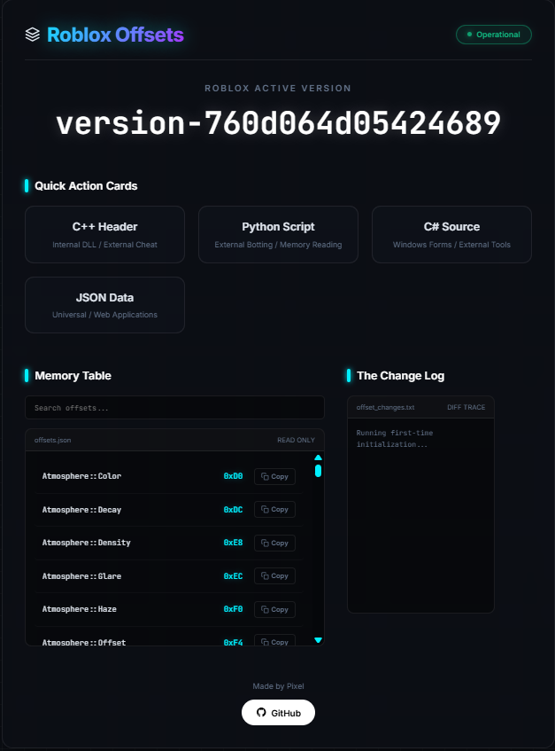

# Roblox Offsets Daily

## Latest Information
- **Last Successful Update:** 2026-03-05 14:58:35 UTC
- **Roblox Client Version:** version-d599f7fc52a8404c
- **Update Frequency:** Every 12-24 hours (Max 26h)
- **Current Status:** Functional (Successfully dumped)

---
## Included Formats
| File Type | Purpose | Best For |
| :--- | :--- | :--- |
| `offsets.h` | C++ Header | Internal DLL / External Cheat Engine |
| `offsets.py` | Python Script | External Botting / Memory Reading |
| `offsets.cs` | C# Source | Windows Forms / External Tools |
| `offsets.json` | JSON Data | Universal / Web Applications |

## Dumped Structures
* **Instance Offsets:** Name, Children, Parent, ClassName
* **DataModel:** Game, Workspace, Players, Lighting
* **Player Classes:** LocalPlayer, Character, Team, UserId
* **Visuals:** ViewMatrix, CameraPosition, FOV

## Live Dashboard
View the active version, track API status, and download offsets on the **[Web Dashboard](https://pixelatedxp.github.io/roblox-offsets-daily/)**.

---
## Credits
* **Dumper Tool:** [roblox-dumper](https://github.com/nopjo/roblox-dumper)
* **Creator:** Jonah (jonahw on Discord)

## Disclaimer
> ⚠️ **Disclaimer:** This repository is for educational and research purposes only. Using these offsets to modify game memory may violate the Terms of Service of the software being analyzed. The maintainer is not responsible for any bans or legal actions resulting from the use of this data.
